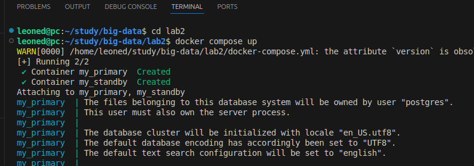
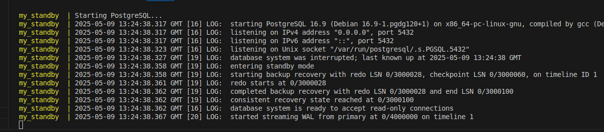
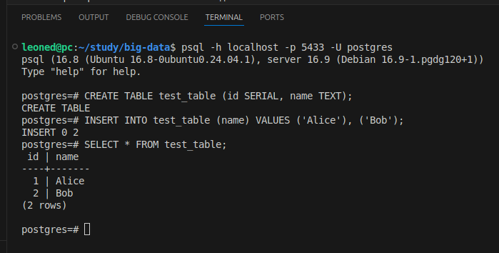
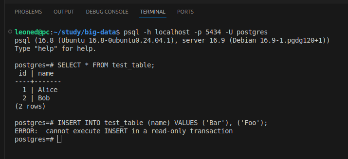
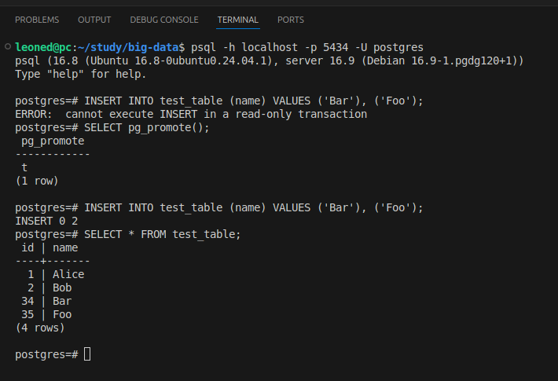

# Лабораторная работа №2
Задание: минимальными действиями поднять primary БД и потоково реплицировать её в standby.

## Конфигурация

Для настройки БД из [docker-compose.yml](./docker-compose.yml) в контейнеры передаются файлы конфигурации:

primary:
* [postgresql.conf](./primary/postgresql.conf)
* [pg_hba.conf](./primary/pg_hba.conf)

standby:
* [postgresql.conf](./standby/postgresql.conf)
* [pg_hba.conf](./standby/pg_hba.conf)
* [init.sh](./standby/init.sh)


## Демонстрация

Поднимаем контейнеры
```shell
cd lab2
docker compose up -d
```



Подключаемся к `primary`
```shell
psql -h localhost -p 5433 -U postgres
```

Создаём тестовые данные
```psql
CREATE TABLE test_table (id SERIAL, name TEXT);
INSERT INTO test_table (name) VALUES ('Alice'), ('Bob');
SELECT * FROM test_table;
```


Подключаемся к `standby`
```shell
psql -h localhost -p 5434 -U postgres
```

Проверяем наличие тестовых данных
```psql
SELECT * FROM test_table;
```

Проверяем `read-only`
```psql
INSERT INTO test_table (name) VALUES ('Bar'), ('Foo');
```


Убиваем `primary`
```
docker stop my_primary
```

Превращаем standby в автономную `writable` БД
```psql
SELECT pg_promote();
INSERT INTO test_table (name) VALUES ('Bar'), ('Foo');
SELECT * FROM test_table;
```
