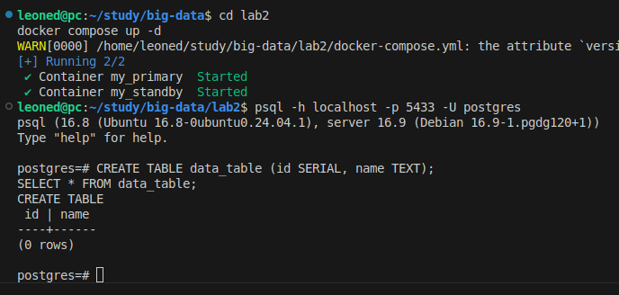
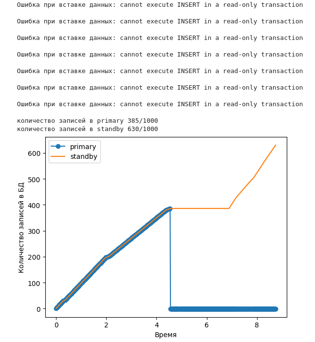

# Лабораторная работа №3
Задание: отследить потерю данных в кластере БД при отключении primary сервера.

Этапы:
* Имитировать равномерную нагрузку на БД
* Реалирзовать reverse proxy для автоматического `promote` standby сервера
* Построить графики нагруженности `primary` и `standby` серверов

## Настраиваем окружение

Генерировать нагрузку и отслеживать количество записей в БД буду при помощи [jupyter notebook](./lab3.ipynb)
```shell
cd lab3
python3 -m venv venv
source venv/bin/activate
```
```python
pip install jupyter lab
jupyter lab
```

Отслеживать утечку данных будем на основе кластера из [прошлой лабы](../lab2/README.md). Поэтому поднимем кластер с одной таблицей.
```shell
cd lab2
docker compose up -d
```
```psql
psql -h localhost -p 5433 -U postgres
```
```psql
CREATE TABLE data_table (id SERIAL, name TEXT);
SELECT * FROM data_table;
```

## Python скрипт
состоит из нескольких логических частей:
1) на протяжении 10 секунд 10 раз в секнду данные передаются в `reverse proxy` для записи в БД
2) `reverse proxy` отслеживает жив ли `primary` и при потере соединения делает `promote` standby
3) `logger` 10 раз в секунду собирает информацию о количестве данных а обеих БД. В конце работы отрисовывает соответствующий график 

### Фрагменты кода из [jupyter notebook](./lab3.ipynb)
При невозможности вставки значения в `primary` proxy переключится на работу со `standby`
```python
def proxy_insert(value):
    global is_primary_alive
    if is_primary_alive:
        if not raw_insert(PRIMARY_DB, value):
            is_primary_alive = False
            promote(STANDBY_DB)
    elif not is_primary_alive:
        raw_insert(STANDBY_DB, value)
```

Фунция вставки значения в БД логирует сообщение об ошибке
```python
def raw_insert(db_config, value):
    try:
        with psycopg2.connect(**db_config) as conn:
            with conn.cursor() as cur:
                cur.execute("INSERT INTO data_table (name) VALUES (%s)", (value,))
                conn.commit()
        return True
    except Exception as e:
        print(f"Ошибка при вставке данных: {e}")  # Логируем ошибку
        return False
```

Логгер при каждой иттерации сохраняет в массив количество записей в каждой БД
```python
def log_db(db_config):
    try:
        with psycopg2.connect(**db_config) as conn:
            with conn.cursor() as cur:
                cur.execute("SELECT COUNT(*) FROM data_table")
                count = cur.fetchone()[0]
        return count
    except Exception as e:
        return -1


def log():
    insert_time.append(insert_time[-1] + 1)
    primary_count.append(log_db(config.PRIMARY_DB))
    standby_count.append(log_db(config.STANDBY_DB))
```

В конце работы скрипта будет выведено, сколько записей попало в БД
```python
interval = 0.1  # Период поступления данных
duration = 10   # Длительность 
iterations = int(duration / interval)
    
for _ in range(iterations):
    proxy_insert(get_value())
    log()
    time.sleep(interval)
    
print(f'количество записей в primary {max(primary_count)}/{iterations}')
print(f'количество записей в standby {max(standby_count)}/{iterations}')
plot_logs()
```
## План
1) Поднимаем кластер БД
2) Запускаем python скрипт
3) Во время работы скрипта убиваем primary командой 
```shell
docker stop my_primary
```

## Итоги
Когда `primary` перестаёт отвечать, его заменяет `standby`. Из-за запаздывания репликации при переходе может потеряться некоторое количество записей. В данном случае БД достаточно лёгкая, поэтому за время экспериментов ни разу не терялось более одного запроса.

